# Split-Keyboard V2

I recently got my PCB from JLCPCB but I realised that I had accidentally inverted the holes for the hotswap sockets. This makes it physically impossible for me to actually assembly it properly. Learning from my failures, I decided to make a V2 which would not only fix the socket problem but also allow me to redo/refine some features. That is I want to add a LiPo battery and change the requirement of having both sides plugged in separately to the PC. I already have the parts to build the keyboard so the grant is only for the PCB (and possibly extra stuff such as LiPo battery, resistors, JST PH connectors, etc)

## Planning

I recently got my PCB from JLCPCB but I realised that I had accidentally inverted the holes for the hotswap sockets. This makes it physically impossible for me to actually assembly it properly. (Awkward placement + overlap with other components)

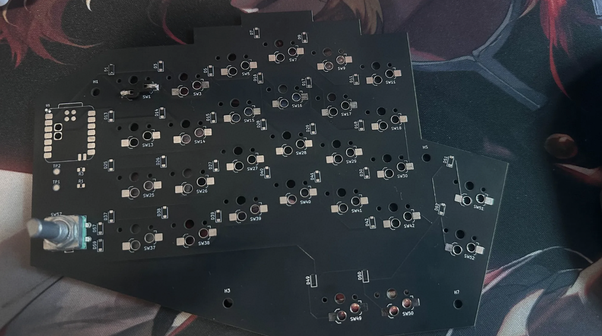
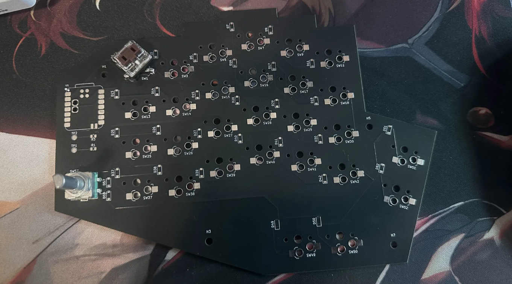

Learning from my failures, I decided to make a V2 which would not only fix the socket problem but also allow me to redo/refine some features. That is I want to add a LiPo battery and change the requirement of having both sides plugged in separately to the PC. I already have the parts to build the keyboard so the grant is only for the PCB (and possibly extra stuff such as LiPo battery, resistors, JST PH connectors, etc)

GOALS:

Fix hotswap socket orientation
Added better connectivity between the split keyboards (Master and Slave RP2040)
Add support for 1s 3.4V LiPo Battery

## Heavily Modified Schematic

So firstly, I realised that to use the master and slave approach, I needed a TRRS which connects the halves via UART. This meant that I needed a UARTTX, UARTRX but all my gpio pins were occupied. After some research I found that the nice!nano v2 was a good choice as it had the same Nordic chip. This allowed for bluetooth connection, a built in linear Li-Po charging circuit which helps avoid clutter. Furthermore, I added a 2 pin JST-PH connector for the Li-Po battery. There is also an RGB LED which will signal green for charged, yellow for 50$, red for low and blue for charging.

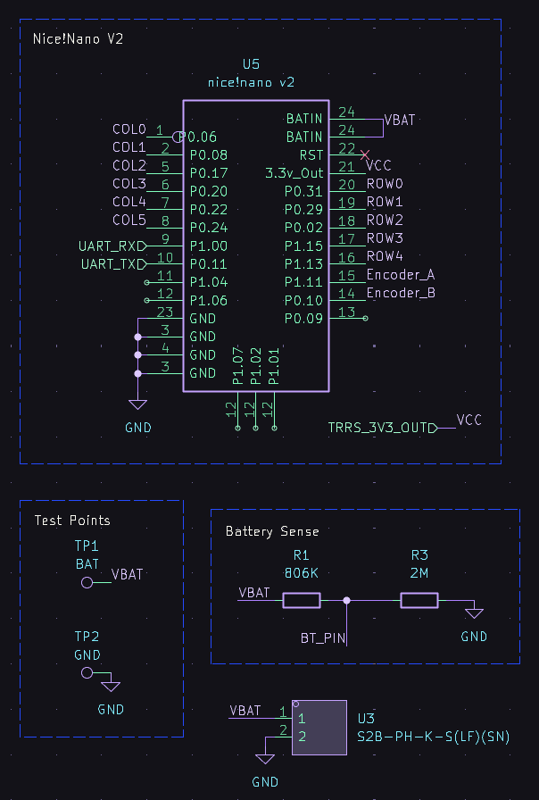
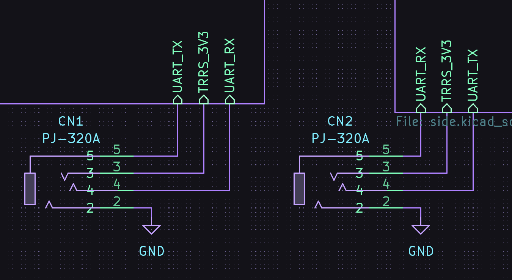
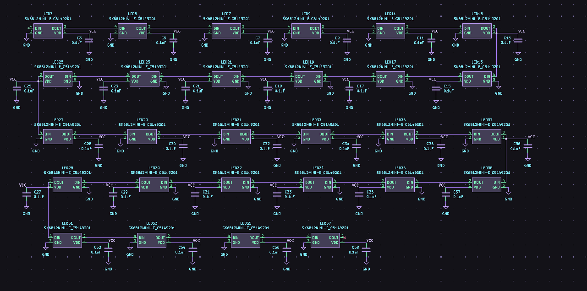

## Routed half the PCB

So I managed to route half the PCB now. There were many problems related to footprints as the Nice!Nano doesn't really have a goof publicly available one and so I had to design it myself. Also I added LED lights for every switch and ensured the hotswap sockets were orientated the right way.

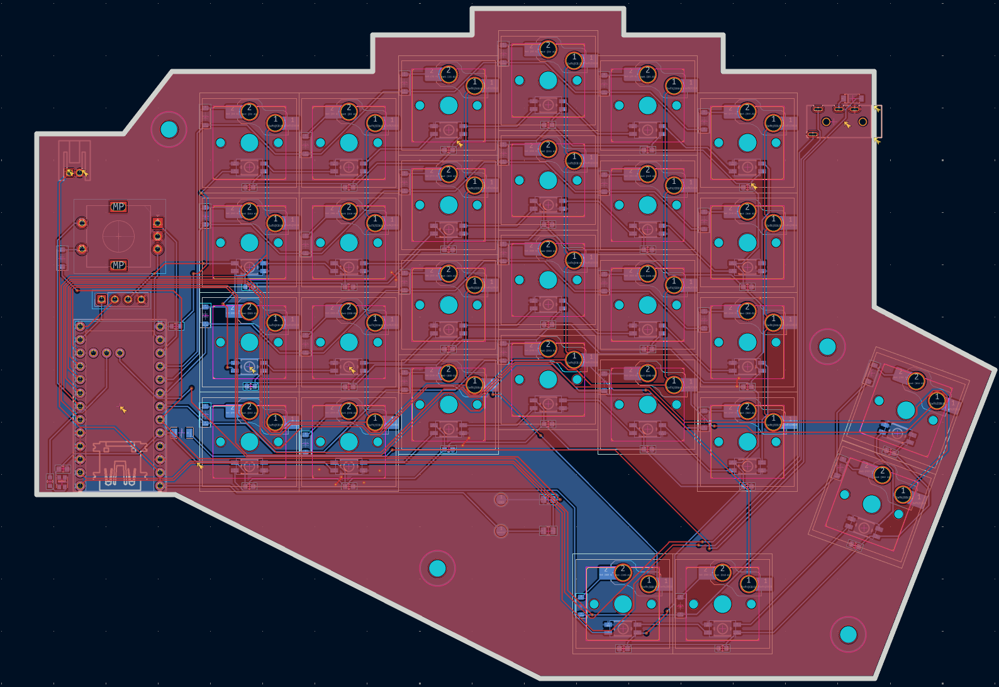
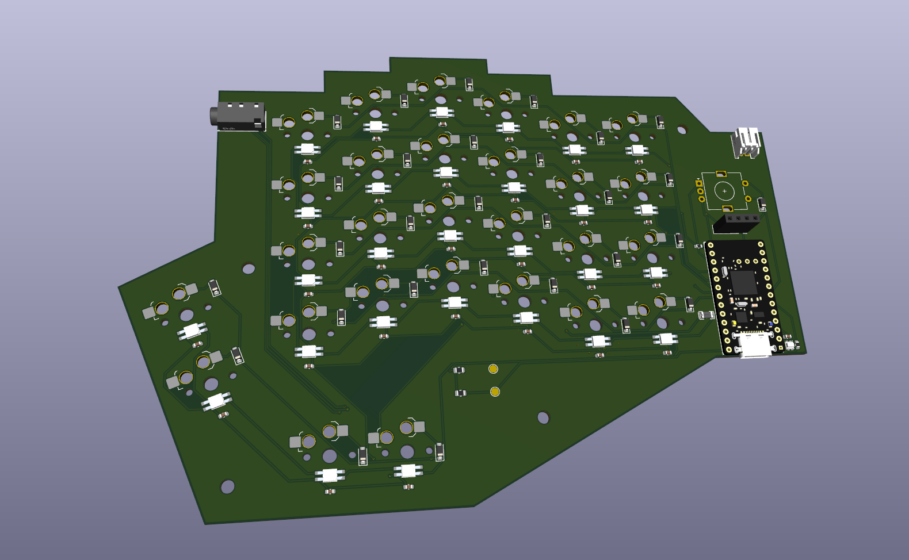

## Finished Routing the PCB

So it took me a while to figure out how to mirror the left side. There was no easy way to do so I ended up flipping the edgecut and then redoing all the wiring. There is only 1 error on the ERC which is the left and right side aren't connected by this will get fixed with a TRRC cable.

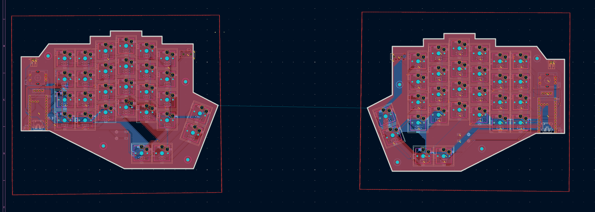
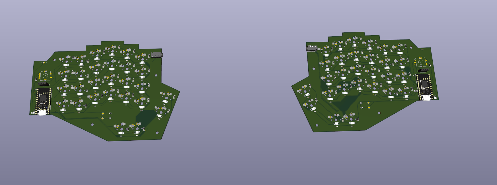

## Gerber Files

I decided to get PCBA due to the keybaord requiring several LED and Diodes which all require a certain orientation to work properly. A few components require PCBA to be placed. I do have 1 or 2 components which I will hand solder myself to help reduce the costs. The PCB was too large for PCBA so I have to order each half of the PCB seperately.

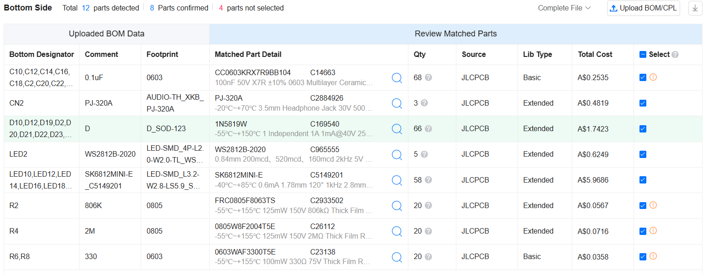
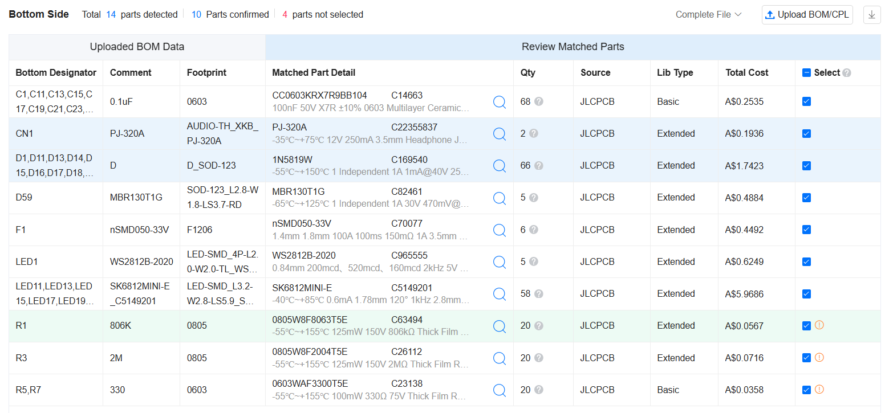
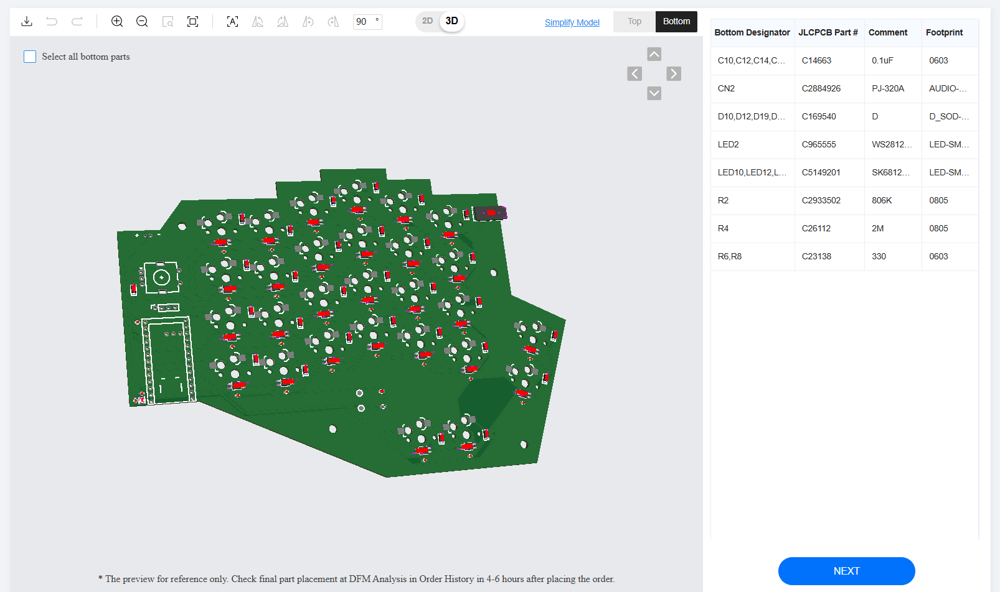
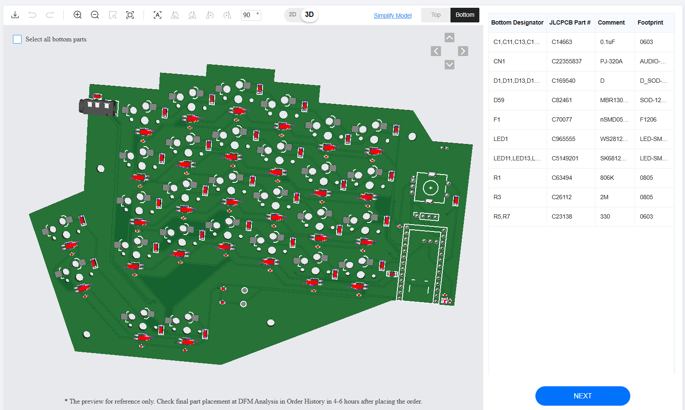
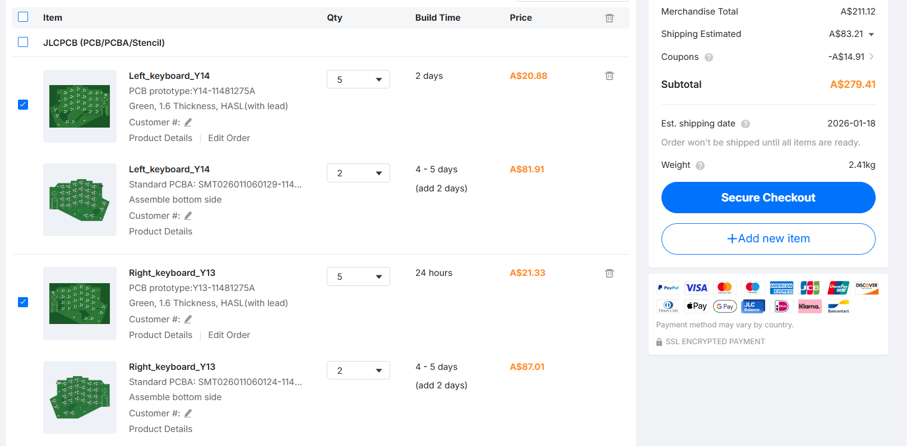
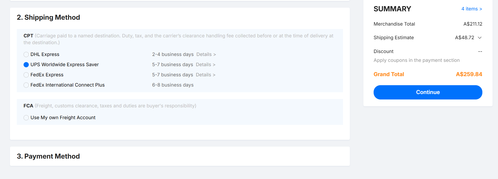

## BOM

So since I already have most of the components such as rotary encoder, key switches, keycaps, etc, the BOM is prely for the parts I need for the PCB (the extra stuff that I didn't solder from JLC). So the total comes to about 227.98 USD. I really do not know how to make it cheaper as I've sourced everything from the cheapest sites I could find i.e aliexpress.

